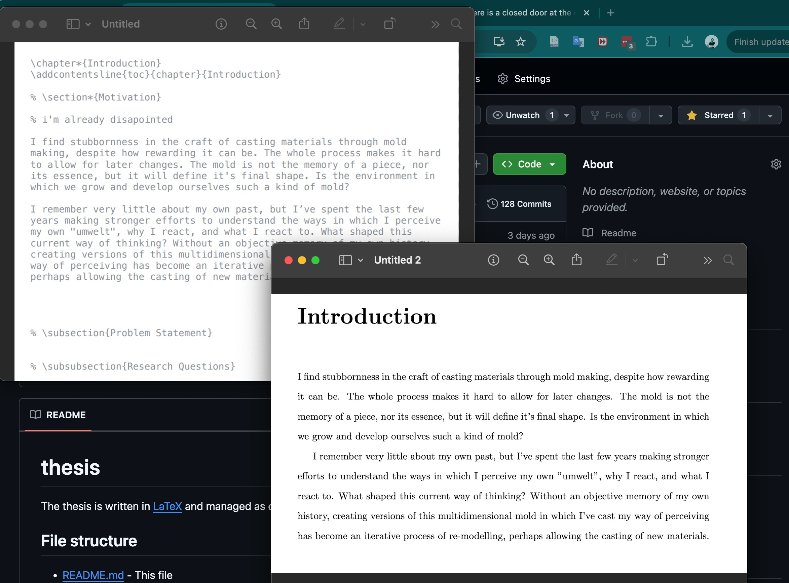

# There is a closed door at the end of the corridor

The title for this thesis comes from an early memory. Without an abundance of organized memories, I clearly remember this corridor in the house where I grew up. It connected the apartment bedrooms to the living room. It was a long corridor and at night the door was always closed, and the light from the other side would squeeze around it through the frame.

The title sets up a journey or exploration, with a hidden aspect, and the intention of uncovering it. The story (% if there is any %) {r}evolves around what is behind the door, why it is closed, and what it means to become a memory.

The corridor leading to the closed door represents a path of self-discovery, introspection, or the confrontation of personal fears. It implies a setting that is likely confined or claustrophobic, adding to an atmosphere of tension. The closed door is the focal point of such tension, ever-present but unreachable, referring to a sense of inevitability. It represents a barrier between worlds, knowledge, or states of mind. Perhaps the boundary between reality and imagination.

In this context, I explore the themes of curiosity, the fear of the unknown, and the tendency to be constantly drawn toward things that are off-limits. What is the fear of the dark if not a fear of the unknown? It’s a driving force for widening the senses and understanding the environment.

This book is the reflection of my current ongoing introspection, exploring unresolved issues, repressed memories, and an attempt to confront the past, to let it go.

This book is written in [LaTeX](https://www.tug.org/texlive/quickinstall.html) and managed as code.

## File structure

* [README.md](README.md) - This file. It describes the contents of this repository.
* [thesis.pdf](https://n2048-creative-technology.github.io/thesis/thesis.pdf) - This thesis compiled as a pdf document
* [thesis.tex](src/thesis.tex) - Document structure and configuration
* [thesis.bib](src/thesis.bib) - References and bibliography
* [**./src/CHAPTERS.tex**](src/) - Text/code for every chapter
* [create.sh](create.sh) - Compilation script
* [latex-pdf.yml](.github/workflows/latex-pdf.yml) - Automatic deployment settings

## Automated deployment 

Every time the text is updated, the code will be compiled into a PDF and it will be made accessible via 
[this link](https://n2048-creative-technology.github.io/thesis/)

[](https://n2048-creative-technology.github.io/thesis/)

## Install LaTex
```
curl -L -o install-tl-unx.tar.gz https://mirror.ctan.org/systems/texlive/tlnet/install-tl-unx.tar.gz
zcat < install-tl-unx.tar.gz | tar x
cd install-tl-20240920/
sudo perl install-tl --no-interaction 
```

Edit ~/.bashrc and add these lines at the end: 
```
export MANPATH=/usr/local/texlive/2024/texmf-dist/doc/man:$MANPATH
export INFOPATH=/usr/local/texlive/2024/texmf-dist/doc/info:$INFOPATH
export PATH=/usr/local/texlive/2024/bin/x86_64-linux:$PATH
```

Install the compilers (if not installed)
```
sudo apt install pdflatex
sudo apt-get install latexml
sudo apt-get install pandoc
sudo apt-get install latex2html
```

## Compilation
Compile the LaTeX documents to a PDF using the following commands: 
```
bibtex thesis
pdflatex thesis.tex 
``` 

## Code Repository
The thesis is stored on [Github](https://github.com/n2048-creative-technology/thesis)

Example of code -> render:

